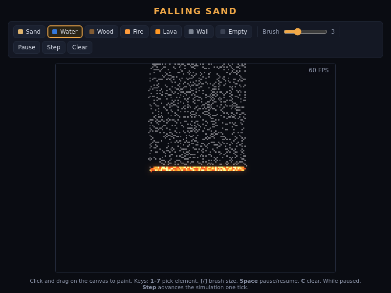

# Falling Sand

A falling-sand physics game built with vanilla HTML5 Canvas and modern JavaScript (ES modules) — no framework, no build step.



## Elements

| Element | Behaviour |
|---------|-----------|
| **Sand** | Falls straight down, slides diagonally when blocked; sinks through liquids (density 4) |
| **Water** | Flows down, spreads sideways and levels out into a pool (density 2) |
| **Wood** | Static flammable solid — burns when in contact with fire or lava |
| **Fire** | Spreads to flammable neighbours, emits smoke, has a finite lifetime; extinguished by water (becomes steam); can leave cinder residue |
| **Lava** | Thick, slow glowing liquid (density 3); ignites wood; reacts with water → stone + steam |
| **Wall** | Static solid that blocks everything |
| **Smoke / Steam** | Gases that rise, drift around obstacles and dissipate over their lifetime |

Density-based displacement: denser particles sink through lighter ones (sand sinks in water, lava displaces water).

## How to run

The game uses ES modules, which browsers block on `file://` — serve the folder over local HTTP with any static server, then open it in a browser.

```sh
# from this directory, pick any of:
npm run serve            # python3 -m http.server 8000
npx serve .
php -S localhost:8000
```

Then open <http://localhost:8000> (or the port your server uses). That's it — no install or build required.

## Controls

- **Mouse / touch**: click and drag to paint the selected element (hold to keep pouring).
- **Keyboard**:
  - `1`–`7` — select element (toolbar order: Sand, Water, Wood, Fire, Lava, Wall, Eraser)
  - `[` / `]` — decrease / increase brush size (1–8)
  - `Space` — pause / resume
  - `C` — clear the canvas
- **Toolbar**: element buttons, brush-size slider, Pause/Resume, Step (one tick while paused), Clear.

## Development

```sh
npm install          # dev dependencies only (puppeteer for browser tests)
npm test             # unit tests: node --test over tests/*.test.js
node tests/browser/smoke.mjs --interaction            # headless-browser smoke + interaction tests
node tests/browser/smoke.mjs --interaction --shot task5-final.png  # ...and save screenshots
```

Notes:

- Unit tests run under plain Node (`node --test`); they exercise the grid and engine directly.
- Browser tests serve the project over localhost, launch headless Chrome (via puppeteer) and assert canvas state, FPS, zero console errors, painting, physics phases and UI controls.
- The simulation runs at a fixed 200×150 resolution on flat typed arrays (`Uint8Array`/`Uint16Array`) with a fixed 60 Hz timestep; CSS scales it up with `image-rendering: pixelated`.

### Project layout

```
index.html            page shell (toolbar, canvas, help)
src/
  grid.js             flat typed-array grid (cells, life, variation, updated flags)
  elements.js         element ids, metadata (density/static/gas/flammable), palettes
  engine.js           fixed-timestep cellular automaton (per-element update rules)
  renderer.js         ImageData rendering + fire/lava glow pass
  ui.js               toolbar, brush slider, pause/step/clear controls
  main.js             game loop, painting input, keyboard shortcuts
  rng.js              deterministic RNG (mulberry32)
  style.css           layout & theme
tests/
  *.test.js           Node unit tests (grid, engine, sand, water, fire)
  browser/smoke.mjs   headless-browser smoke & interaction test
assets/screenshots/   verification screenshots per task
```

## License

GNU General Public License v3.0 — see [LICENSE](LICENSE).
